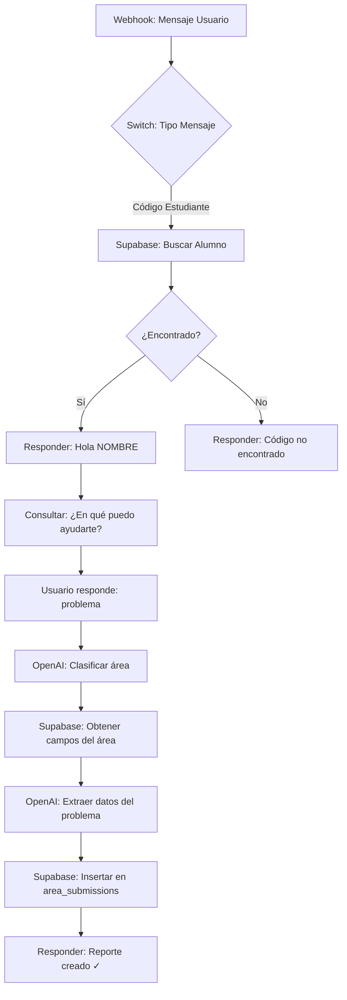

# Integración n8n con Sistema de Gestión Universitaria

## Resumen Ejecutivo

Este documento describe cómo configurar n8n para:
1. ✅ Consultar base de datos de alumnos por código de estudiante
2. ✅ Responder con el nombre del alumno
3. ✅ Crear reportes en el área correspondiente
4. ✅ Identificar reportes creados por IA

---

## 1. Estructura Actual de la Base de Datos

### Tablas Existentes

#### `data_alumnos`
```sql
- id: number (PRIMARY KEY)
- codigo: number (código de estudiante)
- estudiante: string (nombre completo)
- dni: string
- carrera_profesional: string
- facultad: string
- modalidad: string
- ciclo: number
- grupo: string
- celular: string
- religion: string
- fecha_nacimiento: date
- correo: string
- pais: string
```

#### `areas`
```sql
- id: number (PRIMARY KEY)
- name: string (nombre del área)
- description: string
- image_url: string
```

#### `area_submissions` (Reportes)
```sql
- id: number (PRIMARY KEY)
- area_id: number (FK -> areas)
- alumno_id: number (FK -> data_alumnos)
- alumno_dni: string
- alumno_codigo: number
- alumno_nombre: string
- form_data: jsonb (datos del formulario + ubicación)
- submitted_at: timestamp
- status: enum ('pending', 'approved', 'rejected')
```

#### `area_fields` (Campos dinámicos por área)
```sql
- id: number (PRIMARY KEY)
- area_id: number (FK -> areas)
- field_name: string
- field_type: enum ('text', 'textarea', 'file', 'image', 'date', 'select')
- field_label: string
- is_required: boolean
- options: string (JSON)
- placeholder: string
- order_index: number
```

#### `selection_options` (Opciones para selects)
```sql
- id: number (PRIMARY KEY)
- area_id: number
- group_name: string
- option_value: string
- option_label: string
- order_index: number
```

---

## 2. ¿Necesitas Crear Nuevas Tablas?

**NO necesitas crear nuevas tablas.** Puedes usar la tabla existente `area_submissions` agregando un campo adicional en el `form_data` para identificar reportes de IA.

### Opción Recomendada: Agregar campo `created_by`

**Modificación sugerida en la tabla `area_submissions`:**

```sql
ALTER TABLE area_submissions
ADD COLUMN created_by VARCHAR(50) DEFAULT 'usuario';

-- Valores posibles:
-- 'usuario' = Creado por usuario web
-- 'ia_chatbot' = Creado por n8n chatbot
-- 'admin' = Creado por admin
```

**Alternativa (sin modificar tabla):** Agregar dentro de `form_data`:
```json
{
  "created_by": "ia_chatbot",
  "ia_confidence": 0.95,
  "ia_timestamp": "2025-12-02T10:30:00Z",
  ...otros campos del formulario
}
```

---

## 3. Workflow de n8n - Configuración Paso a Paso

### 3.1. Nodos Necesarios

```
1. Webhook Trigger (ya tienes este)
2. Switch Node (para clasificar mensajes)
3. Supabase Node (consulta alumno)
4. Code Node (procesamiento de respuesta)
5. Supabase Node (consulta áreas)
6. OpenAI Node (procesamiento de consulta)
7. Supabase Node (insertar reporte)
8. Respond to Webhook
```

### 3.2. Flujo Completo del Workflow



---

## 4. Configuración Detallada por Nodo

### NODO 1: Webhook Trigger (Ya configurado)

```json
{
  "name": "Webhook Chat",
  "type": "n8n-nodes-base.webhook",
  "webhookUrl": "https://cristhianqs24.app.n8n.cloud/webhook/e5f08322-e670-444f-b070-4ad1bba2245b/chat"
}
```

---

### NODO 2: Switch - Clasificar Tipo de Mensaje

**Condiciones:**
1. **Si el mensaje es un número (código)** → Buscar alumno
2. **Si ya tiene alumno identificado** → Procesar consulta
3. **Otro** → Mensaje de ayuda

```javascript
// Code para detectar si es código de estudiante
const mensaje = $json.body.message || '';
const esCodigoEstudiante = /^\d{6,10}$/.test(mensaje.trim());

return {
  esCodigoEstudiante,
  mensaje: mensaje.trim()
};
```

---

### NODO 3: Supabase - Buscar Alumno por Código

**Configuración:**
- **Operation:** Select Rows
- **Table:** `data_alumnos`
- **Filter:** `codigo = {{ $json.mensaje }}`

**SQL Equivalente:**
```sql
SELECT * FROM data_alumnos
WHERE codigo = {{ codigo_del_usuario }};
```

---

### NODO 4: Code - Guardar Datos del Alumno en Sesión

```javascript
// Guardar datos del alumno en el contexto del workflow
const alumno = $input.item.json;

if (alumno) {
  // Guardar en memoria del workflow (puedes usar $workflow.staticData)
  $workflow.staticData.currentAlumno = {
    id: alumno.id,
    codigo: alumno.codigo,
    nombre: alumno.estudiante,
    dni: alumno.dni,
    carrera: alumno.carrera_profesional,
    facultad: alumno.facultad
  };

  return {
    json: {
      response: `¡Hola ${alumno.estudiante}! 👋\n\n¿En qué área necesitas reportar un problema?\n\nÁreas disponibles:\n1. Infraestructura\n2. Servicios académicos\n3. Tecnología\n4. Otros`,
      alumno: $workflow.staticData.currentAlumno
    }
  };
} else {
  return {
    json: {
      response: "❌ No encontré tu código de estudiante. Por favor verifica e intenta nuevamente.",
      error: true
    }
  };
}
```

---

### NODO 5: Supabase - Obtener Áreas Disponibles

**Configuración:**
- **Operation:** Select Rows
- **Table:** `areas`
- **Order by:** `name ASC`

```javascript
// Formatear respuesta con las áreas
const areas = $input.all().map(item => item.json);
const areasTexto = areas.map((a, i) =>
  `${i + 1}. ${a.name}`
).join('\n');

return {
  json: {
    response: `Por favor selecciona el área:\n\n${areasTexto}`,
    areas: areas
  }
};
```

---

### NODO 6: OpenAI - Clasificar Área del Problema

**Prompt para OpenAI:**
```javascript
const alumno = $workflow.staticData.currentAlumno;
const mensaje = $json.body.message;
const areas = $json.areas; // del nodo anterior

const prompt = `
Eres un asistente de universidad. Un estudiante reporta:
"${mensaje}"

Áreas disponibles:
${areas.map(a => `- ${a.id}: ${a.name}`).join('\n')}

Responde SOLO con el ID del área más apropiada (número).
Si no estás seguro, responde "0".
`;

return {
  json: {
    prompt: prompt,
    modelo: 'gpt-3.5-turbo',
    temperatura: 0.3
  }
};
```

**Configuración OpenAI Node:**
- **Resource:** Message
- **Model:** gpt-3.5-turbo
- **Prompt:** `{{ $json.prompt }}`
- **Temperature:** 0.3

---

### NODO 7: Supabase - Obtener Campos del Área Seleccionada

**Configuración:**
- **Operation:** Select Rows
- **Table:** `area_fields`
- **Filter:** `area_id = {{ $json.areaId }}`
- **Order by:** `order_index ASC`

```javascript
// Procesar campos para solicitar al usuario
const campos = $input.all().map(item => item.json);
const camposRequeridos = campos.filter(c => c.is_required);

return {
  json: {
    response: `Por favor proporciona la siguiente información:\n\n${
      camposRequeridos.map((c, i) =>
        `${i + 1}. ${c.field_label}`
      ).join('\n')
    }`,
    campos: campos
  }
};
```

---

### NODO 8: OpenAI - Extraer Información del Problema

**Prompt:**
```javascript
const alumno = $workflow.staticData.currentAlumno;
const mensaje = $json.body.message;
const campos = $json.campos;

const prompt = `
Extrae la siguiente información del mensaje del estudiante:
Mensaje: "${mensaje}"

Campos requeridos:
${campos.map(c => `- ${c.field_name}: ${c.field_label} (${c.field_type})`).join('\n')}

Responde en formato JSON con los valores extraídos.
Ejemplo: {"descripcion": "...", "urgencia": "alta", ...}
`;

return {
  json: {
    prompt: prompt,
    modelo: 'gpt-3.5-turbo',
    temperatura: 0.2,
    responseFormat: 'json_object'
  }
};
```

---

### NODO 9: Supabase - Insertar Reporte en area_submissions

**Configuración:**
- **Operation:** Insert
- **Table:** `area_submissions`

```javascript
// Preparar datos para insertar
const alumno = $workflow.staticData.currentAlumno;
const areaId = $json.areaId;
const formDataFromAI = JSON.parse($json.aiResponse);

const reporteData = {
  area_id: areaId,
  alumno_id: alumno.id,
  alumno_dni: alumno.dni,
  alumno_codigo: alumno.codigo,
  alumno_nombre: alumno.nombre,
  form_data: {
    ...formDataFromAI,
    // ⭐ IDENTIFICADOR DE IA
    created_by: 'ia_chatbot',
    ia_metadata: {
      timestamp: new Date().toISOString(),
      confidence: 0.85,
      model: 'gpt-3.5-turbo',
      workflow_id: $workflow.id,
      execution_id: $execution.id
    }
  },
  status: 'pending',
  created_by: 'ia_chatbot'  // Si agregaste la columna
};

return {
  json: reporteData
};
```

---

### NODO 10: Respond to Webhook - Confirmación

```javascript
return {
  json: {
    response: `✅ Tu reporte ha sido registrado exitosamente.\n\n📋 Detalles:\n- Área: ${$json.areaNombre}\n- Estado: Pendiente\n- Número de ticket: #${$json.insertedId}\n\n🤖 Este reporte fue creado por el asistente IA.\n\nRecibirás una notificación cuando sea atendido.`
  }
};
```

---

## 5. Identificar Reportes de IA en la Interfaz

### Opción 1: Agregar Badge en la Lista de Reportes

**Archivo:** `src/components/VisualizarReportes.tsx` o similar

```tsx
// En el componente que muestra los reportes
const esReporteIA = (submission: AreaSubmission) => {
  return submission.created_by === 'ia_chatbot' ||
         submission.form_data?.created_by === 'ia_chatbot';
};

// En el render
{submissions.map((submission) => (
  <div key={submission.id} className="border rounded-lg p-4">
    <div className="flex items-center justify-between">
      <h3>{submission.alumno_nombre}</h3>

      {/* ⭐ BADGE DE IA */}
      {esReporteIA(submission) && (
        <span className="inline-flex items-center gap-1 px-3 py-1 bg-purple-100 text-purple-700 rounded-full text-xs font-medium">
          <svg className="w-4 h-4" fill="currentColor" viewBox="0 0 20 20">
            <path d="M10 2a8 8 0 100 16 8 8 0 000-16zm0 14a6 6 0 110-12 6 6 0 010 12z"/>
          </svg>
          Creado por IA
        </span>
      )}
    </div>
    {/* resto del contenido */}
  </div>
))}
```

### Opción 2: Icono en la Tarjeta

```tsx
{esReporteIA(submission) && (
  <div className="absolute top-2 right-2">
    <span className="inline-flex items-center gap-1 px-2 py-1 bg-gradient-to-r from-purple-500 to-pink-500 text-white rounded-full text-xs font-bold shadow-lg">
      🤖 IA
    </span>
  </div>
)}
```

### Opción 3: Color de Borde Diferente

```tsx
<div className={`border-2 rounded-lg p-4 ${
  esReporteIA(submission)
    ? 'border-purple-400 bg-purple-50'
    : 'border-gray-200'
}`}>
```

---

## 6. Flujo de Conversación Completo - Ejemplo

### Ejemplo de Interacción Usuario-Chatbot

```
[Usuario escribe]
👤: 202110234

[Chatbot responde]
🤖: ¡Hola Juan Pérez! 👋

¿En qué área necesitas reportar un problema?

Áreas disponibles:
1. Infraestructura
2. Servicios académicos
3. Tecnología
4. Otros

---

[Usuario responde]
👤: La puerta del salón B-201 está rota

[Chatbot procesa]
🤖: Entiendo, necesitas reportar un problema de infraestructura.

¿Puedes darme más detalles?
- ¿Cuál es el problema exacto?
- ¿Qué tan urgente es? (bajo/medio/alto)
- ¿En qué pabellón y salón?

---

[Usuario responde]
👤: La puerta no cierra bien, está descolgada de las bisagras. Es urgente porque no se puede cerrar el salón. Es el pabellón B, salón 201.

[Chatbot procesa con OpenAI]
🤖: Perfecto, voy a crear el reporte...

✅ Tu reporte ha sido registrado exitosamente.

📋 Detalles:
- Área: Infraestructura
- Problema: Puerta descolgada
- Ubicación: Pabellón B - Salón 201
- Urgencia: Alta
- Estado: Pendiente
- Número de ticket: #1234

🤖 Este reporte fue creado por el asistente IA.

Recibirás una notificación cuando sea atendido.
```

---

## 7. Script SQL - Agregar Campo created_by (Opcional)

Si decides agregar una columna dedicada en lugar de usar `form_data`:

```sql
-- Agregar columna para identificar origen del reporte
ALTER TABLE area_submissions
ADD COLUMN created_by VARCHAR(50) DEFAULT 'usuario';

-- Agregar índice para consultas rápidas
CREATE INDEX idx_area_submissions_created_by
ON area_submissions(created_by);

-- Agregar comentario
COMMENT ON COLUMN area_submissions.created_by IS
'Origen del reporte: usuario, ia_chatbot, admin';

-- Actualizar reportes existentes
UPDATE area_submissions
SET created_by = 'usuario'
WHERE created_by IS NULL;
```

---

## 8. Configuración de n8n - Credenciales Supabase

### Crear Credenciales en n8n

1. Ve a **Settings > Credentials**
2. Click **Add Credential**
3. Selecciona **Supabase**
4. Configura:
   - **Host:** `https://tu-proyecto.supabase.co`
   - **Service Role Key:** (desde tu proyecto Supabase)

### Permisos Necesarios (Service Role Key)

Tu Service Role Key debe tener permisos para:
- ✅ SELECT en `data_alumnos`
- ✅ SELECT en `areas`
- ✅ SELECT en `area_fields`
- ✅ SELECT en `selection_options`
- ✅ INSERT en `area_submissions`

---

## 9. Mejoras Adicionales Sugeridas

### 9.1. Validación de Ubicación

Agregar nodo para validar que el pabellón y salón existan:

```javascript
// Validar ubicación antes de insertar
const { data: pabellon } = await supabase
  .from('pabellones')
  .select('id, nombre')
  .eq('nombre', ubicacionExtraida.pabellon)
  .single();

const { data: salon } = await supabase
  .from('salones')
  .select('id, nombre')
  .eq('pabellon_id', pabellon.id)
  .eq('nombre', ubicacionExtraida.salon)
  .single();
```

### 9.2. Notificaciones por Email

Agregar nodo de Email después de insertar reporte:

```javascript
// Send Email Node
{
  to: alumno.correo,
  subject: `Reporte #${reporteId} creado - ${areaNombre}`,
  body: `Hola ${alumno.nombre},

Tu reporte ha sido creado exitosamente.

Detalles:
- Número: #${reporteId}
- Área: ${areaNombre}
- Estado: Pendiente

Serás notificado cuando sea atendido.

Saludos,
Sistema de Gestión UPEU
🤖 (Generado automáticamente por IA)`
}
```

### 9.3. Logging y Analytics

Crear tabla para hacer seguimiento de interacciones:

```sql
CREATE TABLE chatbot_interactions (
  id SERIAL PRIMARY KEY,
  alumno_id INT REFERENCES data_alumnos(id),
  mensaje_usuario TEXT,
  respuesta_chatbot TEXT,
  area_detectada INT REFERENCES areas(id),
  reporte_creado_id INT REFERENCES area_submissions(id),
  timestamp TIMESTAMP DEFAULT NOW(),
  metadata JSONB
);
```

---

## 10. Testing del Workflow

### Casos de Prueba

1. **Código válido**
   - Input: `202110234`
   - Esperado: Saludo con nombre del alumno

2. **Código inválido**
   - Input: `999999999`
   - Esperado: Mensaje de error

3. **Reporte simple**
   - Input: "La luz del salón B-101 no funciona"
   - Esperado: Reporte creado en área de Infraestructura

4. **Reporte con ubicación incorrecta**
   - Input: "Problema en el pabellón Z"
   - Esperado: Solicitar aclaración

---

## 11. Resumen de Archivos a Modificar

### En el Frontend (React)

```
src/components/VisualizarReportes.tsx
  ↳ Agregar badge "Creado por IA"

src/components/VisualizarReportesOro.tsx
  ↳ Agregar badge "Creado por IA"

src/components/modals/ModalDetalleReporte.tsx
  ↳ Mostrar metadata de IA si existe
```

### En Supabase (Base de Datos)

```sql
-- OPCIONAL: Agregar columna
ALTER TABLE area_submissions
ADD COLUMN created_by VARCHAR(50) DEFAULT 'usuario';

-- OPCIONAL: Tabla de logs
CREATE TABLE chatbot_interactions (...);
```

### En n8n (Workflow)

```
1. Webhook Trigger (ya existe)
2. Switch Node (clasificar tipo mensaje)
3. Supabase: Buscar alumno
4. Code: Guardar sesión
5. Supabase: Listar áreas
6. OpenAI: Clasificar área
7. Supabase: Campos del área
8. OpenAI: Extraer datos
9. Supabase: Insertar reporte
10. Respond: Confirmación
```

---

## 12. Próximos Pasos

1. ✅ **Paso 1:** Decidir si agregar columna `created_by` en DB
2. ✅ **Paso 2:** Crear workflow en n8n siguiendo el diseño
3. ✅ **Paso 3:** Configurar credenciales de Supabase en n8n
4. ✅ **Paso 4:** Modificar componentes React para mostrar badge
5. ✅ **Paso 5:** Probar flujo completo
6. ✅ **Paso 6:** Ajustar prompts de OpenAI según resultados

---

## 13. Contacto y Soporte

Para dudas sobre la implementación:
- Revisar logs de n8n
- Verificar credenciales de Supabase
- Comprobar que las tablas existan
- Validar que el Service Role Key tenga permisos

---

**Documento creado:** 2025-12-02
**Versión:** 1.0
**Última actualización:** 2025-12-02
